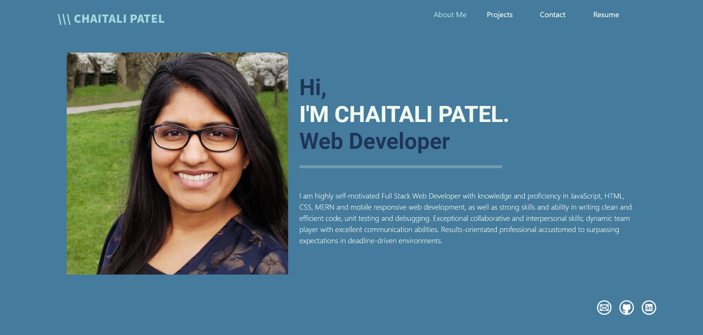

# Dev-portfolio

A simple SPA developer portfolio created using react. It is used to showcase my projects, skills, resume and contact information for future employer or client.

## Build With 
* React.js
* Node.js
* Express.js
* CSS
* Bootstrap
* JavaScript

## Installation
* Installation: npm install
* In the project directory: npm start
* Local development: Open http://localhost:3000 to view it in the browser

## App link
https://chaitalizn.github.io/dev-portfolio/ 

## App

## By
Chaitali Patel
